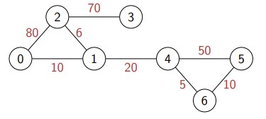

# Data-Structures-and-Algorithms
### Collection of Data Structures implemented Efficiently in Python (OOPS)

[1. Singly Linked List](Singly_Linked_List.py) 
[2. Stack](Stack.py) 
[3. Queue](Queue.py) 
[4. Binary Search Tree (BST)](BST.py) 

### Collection of Shortest Path Algorithms 

[1. Dijkstra](Dijkstra.py) 

[2. Bellman Ford](Bellman_Ford.py) 