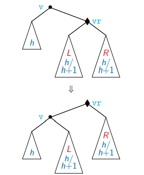
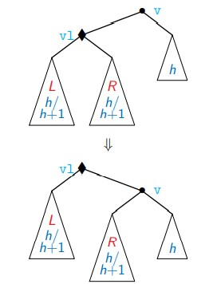

# Data-Structures-and-Algorithms
### Collection of Data Structures implemented Efficiently in Python (OOPS)

[1. Singly Linked List](Data_Structures/Singly_Linked_List.py) 
[2. Stack](Data_Structures/Stack.py) 
[3. Queue](Data_Structures/Queue.py) 
[4. Min Heap](Data_Structures/Min_Heap.py) 
[5. Max Heap](Data_Structures/Max_Heap.py) 
[6. Binary Search Tree (BST)](Data_Structures/BST.py) 
[7. Adelson Velskii Landis Tree (AVL)](Data_Structures/AVL.py) 
&nbsp;&nbsp;&nbsp;a) Left Rotate 
		
		  
	b) Right Rotate 
		
		  

### Collection of Traversal Algorithms

[1. Breadth First Search](Traversal/BFS.py) 
 
[2. Depth First Search](Traversal/DFS.py) 
 

### Collection of Shortest Path Algorithms 

[1. Dijkstra](Shortest_Path/Dijkstra.py)
  

  
[2. Bellman Ford](Shortest_Path/Bellman_Ford.py)
  

  
[3. Floyd Warshall](Shortest_Path/Floyd_Warshall.py)
  

  

### Collection of Minimum Cost Spanning Tree (M.C.S.T.) Algorithms 

[1. Prim's Algorithm](MCST/Prims.py)
  

  
[2. Kruskal's Algorithm](MCST/Kruskals.py)
  

  
[3. Kruskal's Algorithm using Union-Find Data Structure (Efficiency is Improved)](MCST/Kruskals_Union_Find.py)
  

### Instructor

- Prof. Madhavan Mukund, Director, Chennai Mathematical Institute